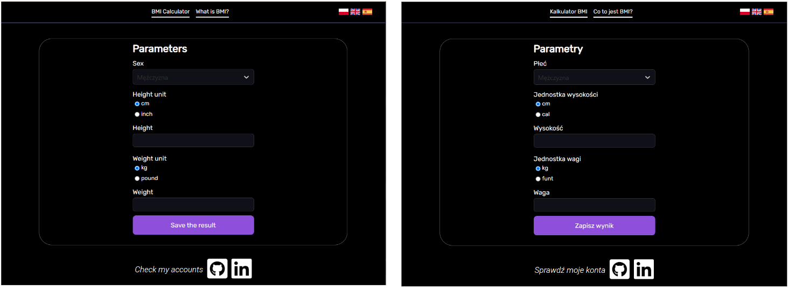
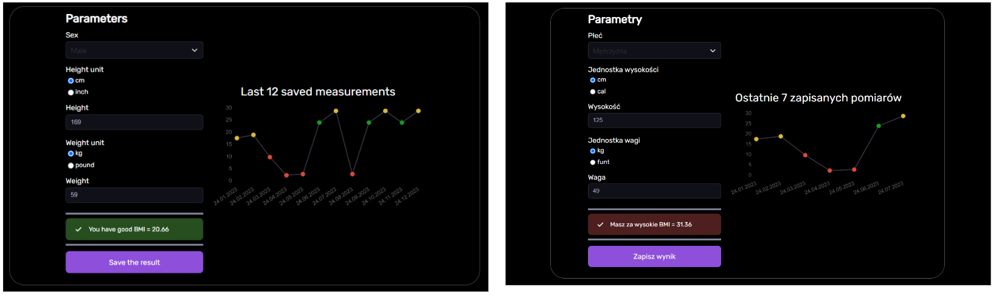
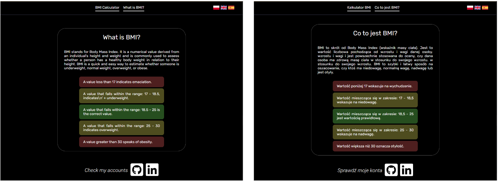
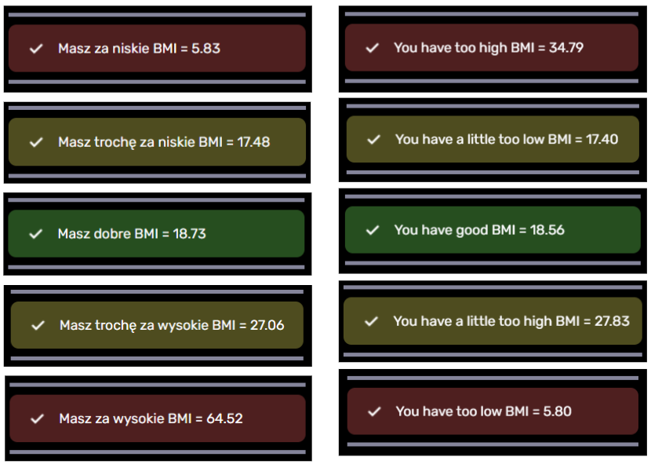
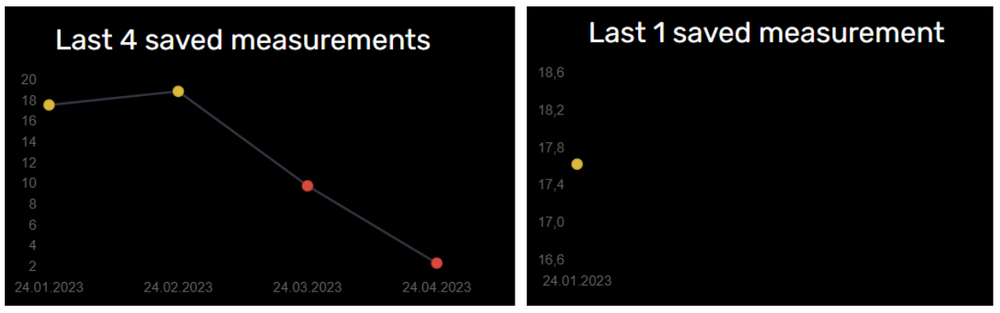
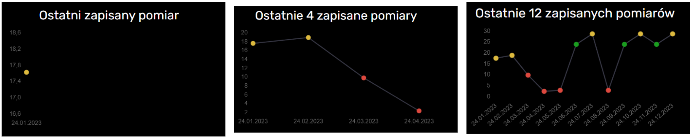
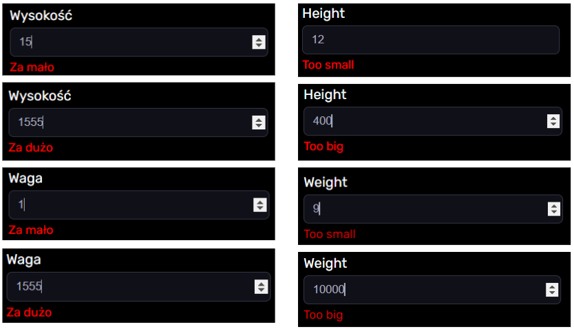
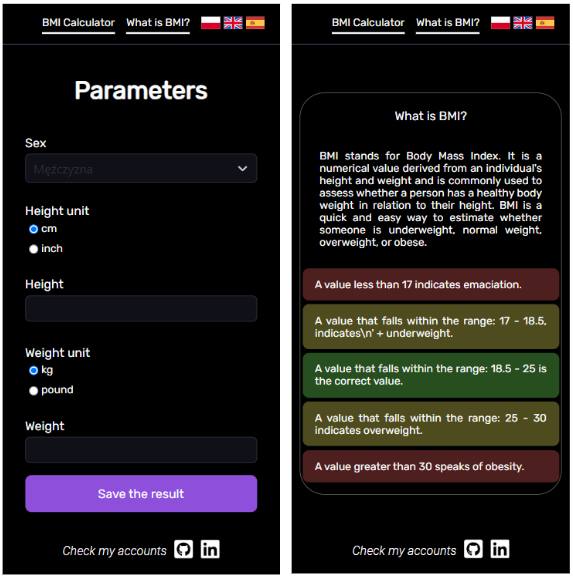
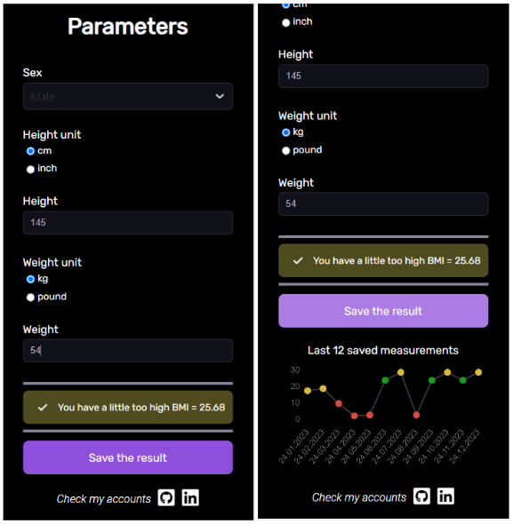

# BMI Calculator 

A web application that allows users to measure BMI, save the result, and also compare their measurements with previous ones.

## Description
This is an application that is used to measure BMI. There are two tabs at the top of the page. In the target tab - 'BMI Calculator' - the user can count his BMI. On the other hand, the 'What is BMI?' tab describes BMI itself, along with a breakdown of the result into normal or abnormal.
To count BMI, the user must fill out a form. It consists of selecting your gender and entering your height and weight. In addition, the user can change the unit in which he gives his height or weight. If the height/weight value is too small or too large, the message 'Too small'/'Too big' is displayed below. After completing the form, the calculated BMI is displayed along with an interpretation of whether the result is correct.
The user can save his or her result, in which case a graph of the measured BMI will appear along with the date of measurement. With the graph, one can observe the changes in one's BMI over the recent past.
On the other hand, at the bottom of the page, there are references to the author's accounts. 

## Features

* The entire application is available in Polish (target language), English, or Spanish.

* Changing the language is available by clicking on the corresponding flag, which is located in the upper right corner.

* When clicking 'What is BMI?', the user is taken to another tab. There is a description of BMI along with its interpretation. After clicking 'BMI Calculator', the user is taken to a tab with a form. The two captions are at the top of the page.

* When entering a height or weight value that is too small or too large, error messages appear.

* Gender is initially marked as 'male'.

* Weight/length units can be changed by selecting the desired measure.

* After completing the form, the calculated BMI appears with a message about whether it is correct. Depending on the interpretation, the color of the window that appears changes.

* The BMI value is saved when the button is pressed. If the user saves a second or subsequent result during the day, the data is overwritten.

* The save button changes its appearance when hovered over or pressed.

* The graph of the BMI measured so far, only appears on the page if the user saves at least one result.

* The color of the markers on the graph depends on the size of the measured BMI.

* In Polish and English, the title of the chart changes depending on the value of the recorded results - a different syntax is used for plurals.* At the bottom of the page there are references to the author's pages. After clicking on the selected icon, the user is redirected to the corresponding page. 

##  Application layout

Below are screenshots showing the layout of the application. The screenshots are in Polish and English language.

* First entry into the application.

* Completing the form.

* BMI description tab. 

* Window with calculated BMI. 

* Chart with different translation depending on the number of recorded results. 

* Form pop-up errors. 

* Mobile version. 

## How to run?

`npm run start` to start project 